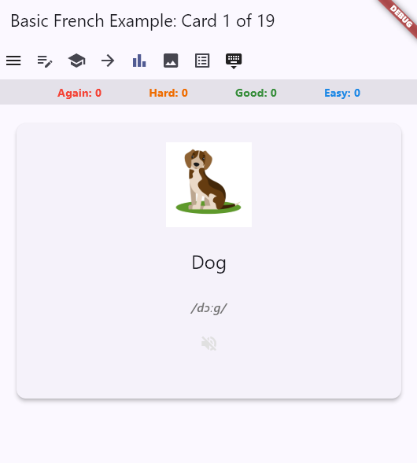
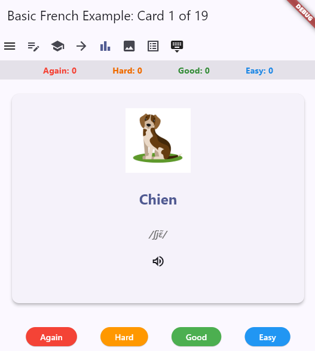
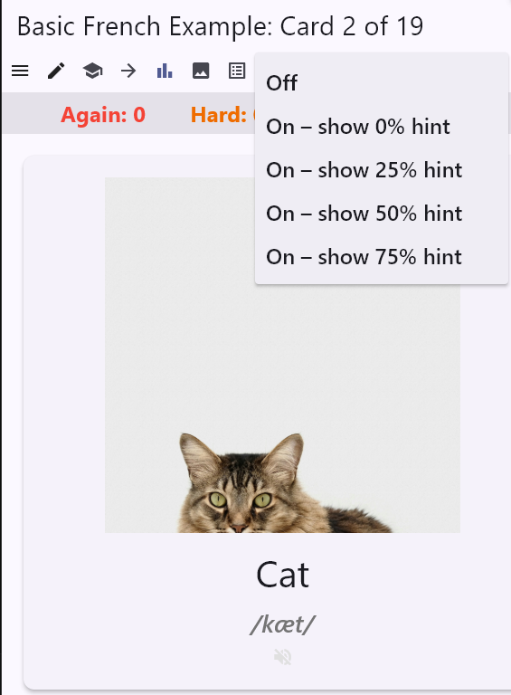
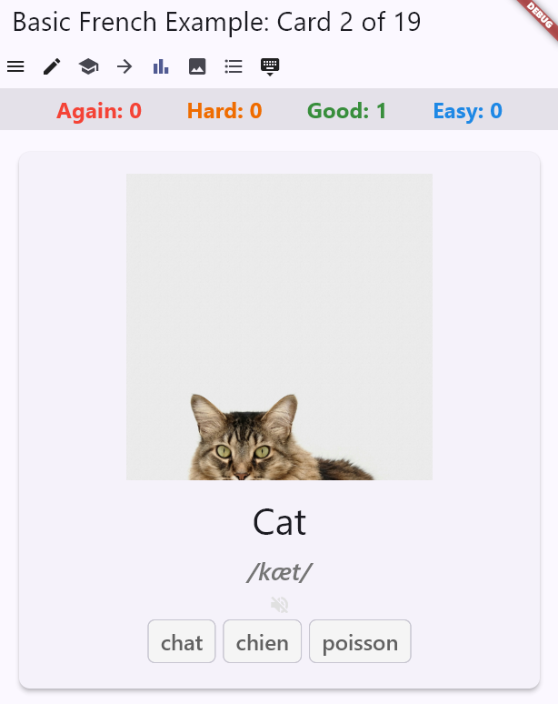
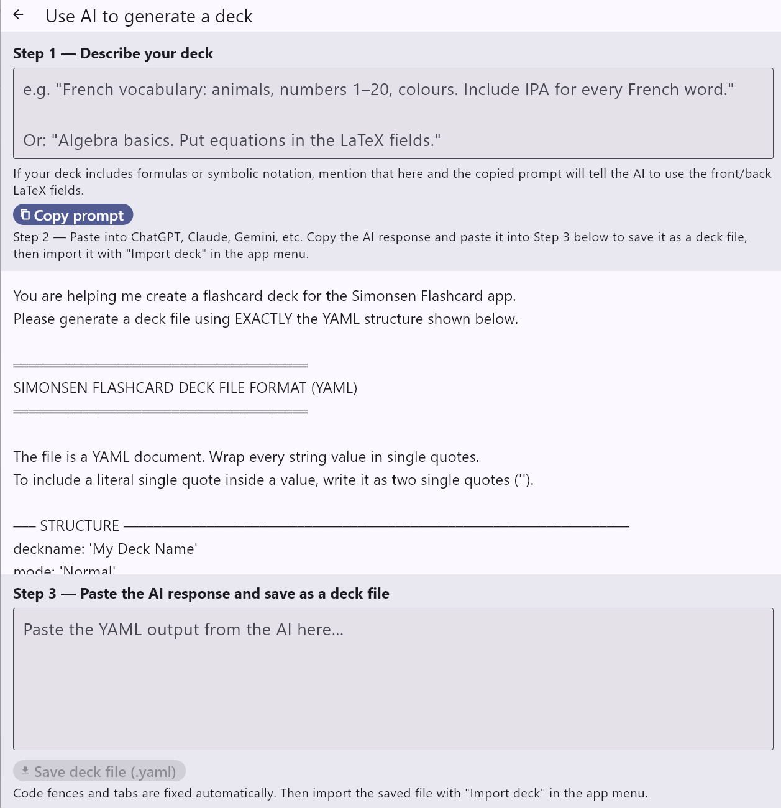

# Simonsen Flashcard App

A Flutter flashcard app for Android and desktop. Designed to be simpler than Anki by offering fewer configuration options and predefined deck modes.

## Screenshots

 
 
 



## Tech stack

- Flutter (Dart)
- Targets: Android, Windows desktop
- UI is platform-specific per target; backend is shared across all platforms
- Key packages: `audioplayers`, `file_selector`, `path_provider`, `flutter_math_fork`, `url_launcher`, `uuid`, `yaml`

## Running the app

```powershell
# Android emulator — disable Play Protect warning (run once)
adb shell settings put global package_verifier_enable 0
adb shell settings put global verifier_verify_adb_installs 0

# Start emulator, then run app
emulator -avd Pixel_7
flutter run -d emulator-5554

# Hot reload (keeps state) / hot restart (clears state) while flutter run is active
# r = hot reload   R = hot restart   q = quit

# Windows desktop
flutter run -d windows
```

> **Note:** Windows desktop requires Developer Mode enabled in system settings (`start ms-settings:developers`).
>
> **Note:** A full `flutter run` is only needed after changing native files (e.g. `AndroidManifest.xml`) or adding packages. For Dart-only changes use hot reload (`r`) instead.

## Project structure

```
lib/
  main.dart                          # platform check → loads Android or Desktop UI
  backend/
    card_model.dart                  # CardModel data class
    card_entry.dart                  # CardEntry: wraps CardModel with id, isDeleted, history
    deck_session.dart                # DeckSession: full in-memory deck (one at a time)
    deck_codec.dart                  # deck file parsing and serialisation (no I/O)
    deck_service.dart                # load/save/delete/import deck files from disk
    stats_service.dart               # read/write review stats (deck.stats.yaml)
    leitner_state.dart               # LeitnerState: box assignments per card
    srs_service.dart                 # Leitner Box SRS algorithm + deck.leitner.yaml persistence
    constants.dart                   # shared constants (app title, default settings, help text)
  utils/
    path_utils.dart                  # deckFolderName() helper (shared across UI layers)
  ui/
    android/
      home_screen.dart               # deck list → open/create deck
      card_session_screen.dart       # card review + hamburger menu
      deck_editor_screen.dart        # add/edit/delete cards in a deck
    desktop/
      home_screen.dart               # folder picker → opens deck
      card_session_screen.dart       # keyboard shortcuts + show/hide image/options toggles
      deck_editor_screen.dart        # add/edit/delete cards in a deck
    shared/
      card_widget.dart               # card flip widget (used by both platforms)
      edit_card_widget.dart          # single-card form with dirty-state guard
      rating_buttons.dart            # Again / Hard / Good / Easy buttons
      help_screen.dart               # in-app help (key concepts + Leitner schedule tables)
      ai_prompt_screen.dart          # AI deck generation prompt helper
      about_dialog.dart              # About dialog
      key_concepts_dialog.dart       # key concepts reference
assets/
  decks/                             # bundled example decks (copied to device on first launch)
    Basic French Example/
    French numbers 0–20 Example/
```

The `backend/` layer has no Flutter UI imports. All UI screens call `backend/` services only — never the file system directly. Parsing logic lives in `deck_codec.dart`, keeping `deck_service.dart` focused on disk I/O only.

## In-memory data model

Only one deck is kept in memory at a time as a `DeckSession`. Each card is stored as a `CardEntry`, which wraps the immutable `CardModel` with:

- a stable integer `id`
- an `isDeleted` flag (soft-delete — card disappears immediately but can be undone before saving)
- a `history` stack of previous `CardModel` versions (undo support)
- optional `CardStats` (loaded from `deck.stats.yaml`)

Cards are only permanently removed or updated when the user explicitly saves the deck.

## Deck file format

Each deck lives in its own folder. All assets are kept in subfolders so decks are fully self-contained and portable.

```
decks/
  My Deck/
    deck.yaml             # card definitions (YAML)
    deck.stats.yaml       # review statistics (auto-generated)
    deck.leitner.yaml     # Leitner box assignments (auto-generated when Leitner mode is used)
    assets/
      images/
        front/
        back/
      audio/
        front/
        back/
```

`image` and `audio` fields store a relative path within `assets/images/` or `assets/audio/` respectively (e.g. `back/chien.mp3`). Omit these fields entirely when unused.

**deck.yaml format — language card with IPA and multiple choice:**

```yaml
deckname: 'My Deck'
mode: 'Normal'
cards:
  - title: 'Dog'
    front:
      question: 'Dog'
      ipa: '/dɔːɡ/'
      options:
        - 'chien'
        - 'chat'
        - 'cheval'
    back:
      answer: 'Chien'
      ipa: '/ʃjɛ̃/'
      audio: 'back/chien.mp3'
      image: 'back/dog.jpg'
      options:
        - 'dog'
        - 'cat'
        - 'horse'
```

**deck.yaml format — math card with LaTeX:**

```yaml
deckname: 'Algebra Basics'
mode: 'Normal'
cards:
  - title: 'Quadratic formula'
    front:
      question: 'What is the quadratic formula for solving ax² + bx + c = 0?'
      latex: 'ax^2 + bx + c = 0'
    back:
      answer: 'x equals negative b plus or minus the square root of b squared minus 4ac, all over 2a.'
      latex: 'x = \frac{-b \pm \sqrt{b^2 - 4ac}}{2a}'
```

| Field           | Description                                                  |
| --------------- | ------------------------------------------------------------ |
| `title`         | Unique identifier for the card                               |
| `question`      | Text shown on the front of the card                          |
| `answer`        | Primary answer shown on the back                             |
| `latex`         | Optional raw LaTeX expression (front or back)                |
| `ipa`           | Optional IPA transcription (front or back)                   |
| `audio`         | Relative path inside `assets/audio/` (e.g. `back/word.mp3`) |
| `image`         | Relative path inside `assets/images/` (e.g. `back/dog.jpg`) |
| `options`       | List of up to 3 multiple-choice options (front or back)      |

All optional fields (`latex`, `ipa`, `audio`, `image`, `options`) may be omitted entirely when unused. String values must be wrapped in single quotes; a literal single quote inside a value is written as two single quotes (`''`).

> **Backward compatibility:** the app transparently reads legacy `deck.flashcarddeck` and `deck.txt` files and migrates them to `deck.yaml` on the next save.

## Hamburger menu (both platforms)

| Item                      | Description                         |
| ------------------------- | ----------------------------------- |
| Open deck                 | Pick from all available decks       |
| New deck                  | Create a blank deck                 |
| Import deck               | Import a `.yaml` or legacy `.flashcarddeck`/`.txt` deck file |
| Edit current deck         | Open the deck editor                |
| Save deck                 | Overwrite current deck on disk      |
| Save deck as              | Save a copy under a new name        |
| Delete deck               | Permanently delete the current deck |
| Help                      | In-app help screen                  |
| Use AI to generate a deck | AI prompt helper                    |
| About                     | App version info                    |

## Desktop UI extras

- **Keyboard shortcuts:** `Space` = flip · `1` = Again · `2` = Hard · `3` = Good · `4` = Easy
- **Edit-note icon:** opens deck editor directly on the current card
- **Study mode selector (toolbar):** tap the graduation-cap icon to switch between Review (sequential) and Leitner Box (spaced repetition)
- **Show/hide image** and **show/hide options** icon buttons in the top bar

## Card editor

- Link buttons open **Google Images** (for image fields) and **soundoftext.com** (for audio fields) in the browser
- Back gesture on Android shows a **"Discard changes?"** dialog if the card has been edited

## Study modes

**Review mode** shows all active cards in their original deck order, looping back to the start after the last card.

**Leitner Box mode** implements a five-box spaced-repetition system:

| Box | Reviewed           | Sessions            |
| --- | ------------------ | ------------------- |
| 1   | Every session      | 1, 2, 3, 4 …        |
| 2   | Every 2nd session  | 2, 4, 6, 8 …        |
| 3   | Every 4th session  | 4, 8, 12, 16 …      |
| 4   | Every 8th session  | 8, 16, 24 …         |
| 5   | Every 16th session | 16, 32, 48 …        |

Rating a card **Again** or **Hard** sends it back to Box 1. **Good** promotes it +1 box; **Easy** promotes it +2 boxes. Box assignments and the session counter are persisted in `deck.leitner.yaml`.

## Review statistics

Every rating is recorded to `deck.stats.yaml` regardless of study mode — this stores lifetime again/hard/good/easy counts and last-reviewed timestamps. Leitner Box scheduling uses its own separate `deck.leitner.yaml` file and does not depend on these stats.

## Architecture note

Only **Normal mode** is implemented. The architecture is designed to add more modes later. All UI logic is kept platform-specific; all data/business logic lives in `backend/` with no UI imports.
